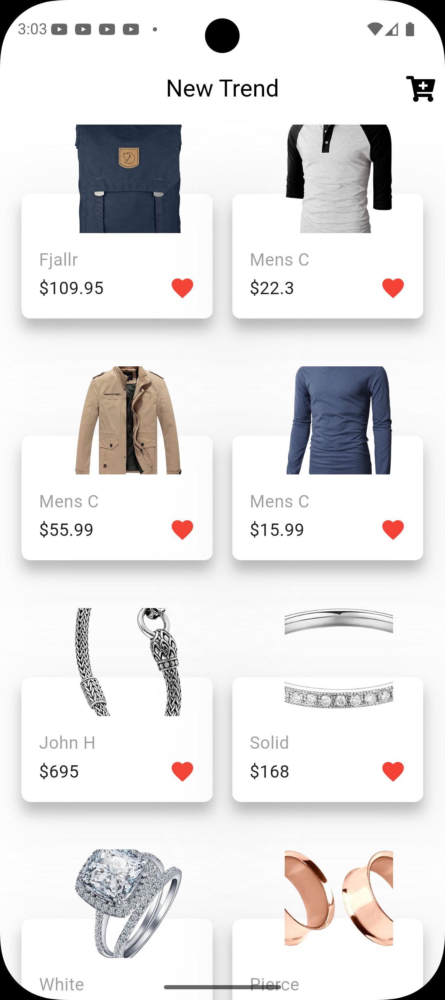
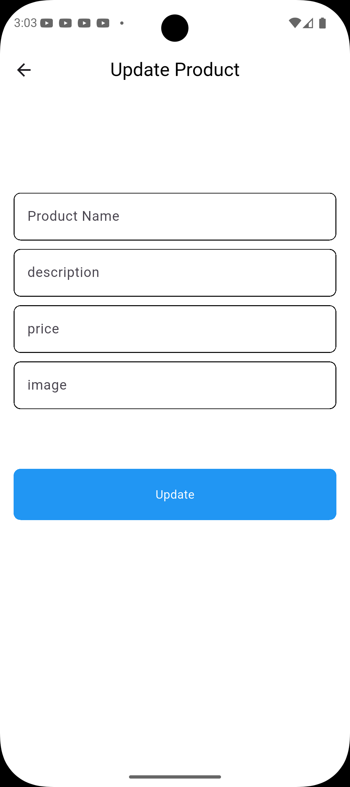

# 🛍️ Store App

A modern and responsive **E-Commerce Application built with Flutter** that allows users to browse products, manage a shopping cart, and place orders easily.

The application provides a clean and intuitive user interface designed for smooth shopping experiences across multiple platforms including mobile, web, and desktop.

---

## ✨ Features

- **Product Catalogue** – Browse a collection of available products
- **Shopping Cart** – Add or remove products and manage quantities
- **User Authentication** – Secure login and registration system
- **Order Management** – Track orders and view purchase history
- **Responsive UI** – Works smoothly on different screen sizes
- **Cross Platform Support** – Runs on mobile, web, and desktop
- **Modern UI Design** – Clean and user-friendly interface

---

## 🛠️ Tech Stack

- **Framework**: Flutter (Dart)
- **Architecture**: Modular project structure
- **State Management**: Flutter state management techniques
- **Backend Communication**: API services
- **UI Components**: Reusable widgets

---

## 📁 Project Structure

```
lib/
├── main.dart              # Application entry point
├── helper/                # Utility functions and helpers
├── models/                # Data models
├── screens/               # App screens and pages
├── services/              # API and business logic services
└── widgets/               # Reusable UI components
```

---

## 🚀 Getting Started

### Prerequisites

Make sure you have installed:

- Flutter SDK **3.0 or higher**
- Dart SDK **2.17 or higher**
- Android Studio or VS Code
- Android SDK (for Android development)
- Xcode (for iOS development)

---

### Installation

1. Clone or download the repository

2. Navigate to the project folder

3. Install dependencies:

```bash
flutter pub get
```

4. Run the application:

```bash
flutter run
```

---

### Building for Production

To build the application for release:

```bash
flutter build apk --release
```

Or for iOS:

```bash
flutter build ios --release
```

Or for Web:

```bash
flutter build web --release
```

---

## 🛒 Application Modules

The application includes the following main modules:

- **Product Module** – Displays available products
- **Cart Module** – Handles adding and removing items
- **Authentication Module** – User login and registration
- **Order Module** – Displays order history and order details

Each module is organised to maintain a scalable and maintainable architecture.

---

## 🧠 Application Logic

The application handles:

- Managing product data
- Handling user authentication
- Managing shopping cart state
- Processing and displaying orders
- Providing a responsive and smooth user interface

---

## 🎨 UI Components

The UI is built using reusable widgets including:

- **Product Card Widget** – Displays product information
- **Cart Item Widget** – Shows items added to the cart
- **Product List View** – Displays products in a scrollable list
- **Order Tile Widget** – Shows order information

---

## 📷 Screenshots

<div align="center">
  
  
</div>


---

## 📦 Supported Platforms

This application can run on:

- ✅ Android
- ✅ iOS
- ✅ Web
- ✅ Windows
- ✅ macOS
- ✅ Linux

---

## 🤝 Contributing

Contributions are welcome! Feel free to fork the repository and submit pull requests for improvements.

### Possible Enhancements

- Add product search functionality
- Implement dark mode
- Add product reviews and ratings
- Add payment gateway integration
- Add wishlist feature
- Improve UI animations

---

## 📜 License

This project is open source and available for learning and development purposes.

---

## 📞 Contact

If you have any questions, feedback, or suggestions, feel free to get in touch. I’m happy to help!